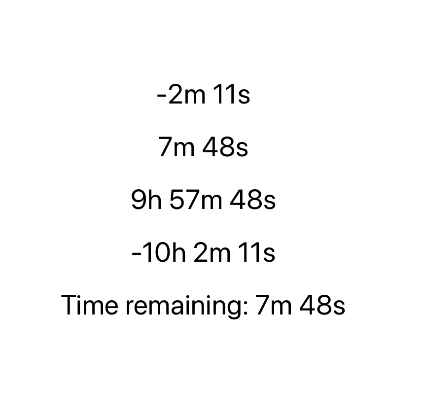

# Swift UI gists

## Start Swift playground

Open `gists.playground` in xcode

```bash
xed ./gists.playground
```

## Contents

### 1. [Countdown](/gists.playground/Pages/countdown.xcplaygroundpage/Contents.swift)

- Customizable real-time countdown
- Compatible with older iOS versions



### 2. [Rotation around point](/gists.playground/Pages/map-pan-animation.xcplaygroundpage/Contents.swift)


